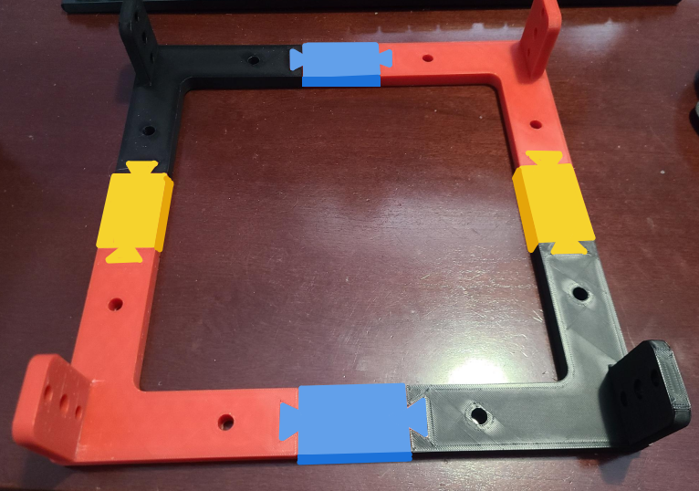
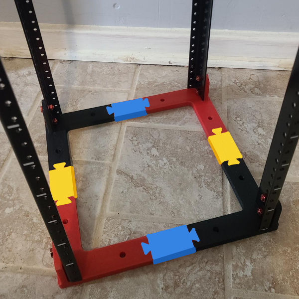

# ButterflyRack
A modular, 3D printed frame for attaching metal rails!

This is a simple 3D-printable design for homemade server racks. It was 
initially designed for 10" racks, per 
[Jeff Geerling's Project Mini-Rack](https://github.com/geerlingguy/mini-rack) 
initiative, but in theory it could be extended to any width (including 19") if 
a butterfly of the appropriate length is used instead of the 2113 shown here.

## Why "Butterfly"?
A key feature of this design is its use of symmetry. Dovetail joints are used 
fix corner brackets together with a modular spacer, but since all corners are 
mirrors of each other, they all have identical dovetail pins. Two identical 
openings cannot be mated without a middle piece called a *butterfly*, which has 
the corresponding "tail" on *both* sides. These modular butterfly spacers can 
easily be extended to any length, making it very simple to build a rack with 
arbitrary depth or width. The height of the rack is determined by the length of 
the rails chosen: the minimum size is 2U, and there is no maximum.

## Bill of Materials
### Printed Parts
 - (4x) Corner Bracket
 - (4x) Mirrored Corner Bracket
 - (4x) 2113mil Butterfly (for a 10" rack)
 - (4x) Butterfly (choose depending on desired depth)

### Hardware
 - (4x) Server Rack Rails (e.g. [these 8U rails](https://www.amazon.com/dp/B00JQYUEA2))
 - (16x) M6x16mm Bolts
 - (16x) M6 Nuts

## Build Instructions

 1. Print all the necessary parts. **Do not forget to mirror half of the** 
**corner brackets in your slicer. They are chiral.** One set of four 2113mil 
butterflies is necessary to fix the width at 10", whereas the second set of 
four butterflies determine the rack's depth and can be any length. Using 
2113mil butterflies again will make a rack that is 10" deep. The other 
pre-made butterflies in this repository are 0mil, which would make a rack that 
is approximately 8" deep, comparable to the 
[DeskPi Rackmate](https://deskpi.com/collections/deskpi-rack-mate). A 
250mm-class printer like the Bambu X1 Carbon can print all 16 parts in just 
two jobs. Smaller printers can still do the job, however; the longest dimension 
of any printed part is just 4.5 inches.

 2. Press-fit four corner brackets together with four butterfly joints. A 
well-calibrated printer should produce parts that fit extremely tightly, but a 
drop of glue or epoxy could be added for peace of mind, if desired. Note that 
identical corner brackets should always be diagonal from one another, never 
adjacent. An example photo is shown below, with each part color-coded:
   - **Red** parts are **standard corner brackets**
   - **Black** parts are the **_mirrored_ corner brackets**
   - **Blue** parts are **2113mil butterflies**, notice how they are aligned 
perpendicularly with the "flat" face of the corner brackets' uprights.
   - **Yellow** parts are the **depth butterflies**, 2113mil in this example.

 3. Using a pair of M6 bolts and corresponding nuts, bolt one rail to each 
corner of the assembled plastic frame. The rail will sit flush with the top 
surface of the corner bracket; you may have to apply some force to make the 
lower hole in the bracket's upright align properly. The friction from the tight 
fit should prevent the need for lock nuts, but a drop of thread adhesive could 
be added if the rack is expected to regularly experience heavy vibration. The 
image below uses the same color scheme as above.

 4. Repeat step 2 with the remaining printed parts and then attach the second 
frame to the other end of the rails the same as in step 3, capping off the 
rack. Congratulations, it is now complete and ready for you to add your 
rack-mount equipment!
